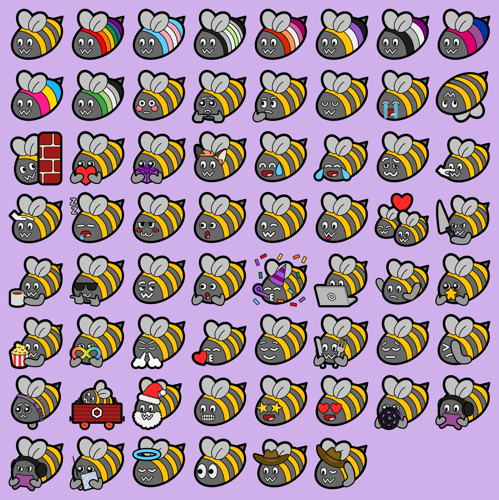

# Blobbee

Blobbee is a set of bee emojis, originally designed to just be pride flag bees
but then expanded to become a full set.

For now, the set of pngs can be downloaded from
[my website](https://beehive.gay/blobbee), but at some point soon I aim to have
various formats available here too.

Blobbees from the `blobbees` directory are licensed under
[CC-BY-SA](https://creativecommons.org/licenses/by-sa/4.0/), and anything in the
`friends` directory is
[CC-BY-NC-SA](https://creativecommons.org/licenses/by-nc-sa/4.0/).

Neofox, Neocat, and BunHD were all created by
[Volpeon](https://volpeon.ink/emojis/).
